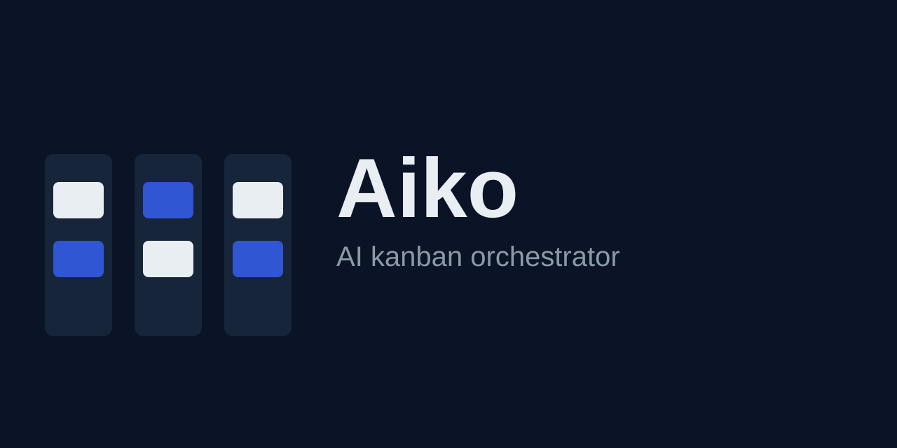

# Aiko - локальный оркестратор ИИ-разработки

<p align="center"></p>

<p align="center">🌐 <a href="README.md">English</a> - <b>Русский</b></p>

[](https://dotnet.microsoft.com/)
[](https://github.com/jrfrigat/Aiko/releases/latest)
[](https://github.com/jrfrigat/Aiko/actions/workflows/ci.yml)
[](https://github.com/jrfrigat/Aiko/actions/workflows/codeql.yml)
[](LICENSE)
[](docs/ru/technical-specification.md)

Aiko (AI kanban orchestrator) - **локальный оркестратор разработки с участием ИИ**: один loopback-демон
дает Claude Code, Codex, Cursor, ZCode и Cline общий контекст проекта, настраиваемый Kanban-конвейер,
устойчивую память и стабильный MCP-контракт - при этом все данные остаются на диске в
Git-дружелюбных Markdown и JSON.

Aiko не заменяет агентов. Он связывает их: карточки двигаются по настраиваемым этапам workflow,
каждый этап может выполнять другой агент, а незавершенный этап (например, после исчерпания лимита)
передается следующему агенту без потери истории.

**File-first хранение - типизированный граф карточек - эффективные приоритеты - handoff между агентами с полной историей попыток - устойчивая память проекта - только loopback по дизайну**

---

## Возможности

- **Локальный демон, один на пользователя** - единый процесс ASP.NET Core обслуживает все
  зарегистрированные проекты: REST API, проектный MCP over Streamable HTTP, health-endpoint'ы и PWA
- **Kanban PWA** на Blazor WebAssembly ([Flare.Blazor](https://github.com/jrfrigat/Flare)):
  доска рисует каждый тип карточек своей секцией и фильтрует по типам прямо на странице, есть экран
  бэклога, редактор карточек, артефакты
  и выполнения; язык интерфейса следует за браузером - поставляются английский и русский, остальные
  языки откатываются на английский
- **Типы карточек, которые вы определяете сами** - тип карточки *и есть* workflow: добавьте `Bug` с
  описанием, иконкой и цветом прямо в редакторе workflow, и он появится в списках выбора, в секциях
  доски и в бэклоге; у каждой колонки-этапа тоже есть свои иконка и цвет. Колонка `backlog` стандартна
  и не удаляется, а отдельный экран **Бэклог** собирает все карточки, ещё не взятые в работу
- **Стандартный шаблон уже проработан** - новый проект начинается с конвейеров epic, story и task, у каждого
  этапа есть иконка, цвет и инструкция, что агент делает на этом этапе, у типов карточек есть описания, а
  карточки оцениваются тремя критериями - `app-point`, `user-point` и `complete`, - причём готовность
  (`complete`) агент пересчитывает после каждого изменения
- **Карточки-каталоги** - каждая карточка это папка с `card.json` (оптимистичные ревизии) и
  Markdown-артефактами; все дерево `.aiko` читаемо, сравнимо в diff и дружелюбно к Git
- **Читаемые адреса проектов** - проект получает короткий ID из имени папки (кириллица транслитерируется),
  редактируемый при создании и используемый во всех URL (`/p/aiko/board`); сгенерированный GUID остаётся
  неизменным ключом внутри `card.json` и MCP-адресов агентов, поэтому межпроектные ссылки не ломаются
- **Типизированный граф карточек** - связи `implements`, `parent-child`, `blocks` (с запретом
  циклов) и симметричная `relates-to`; блокировки учитываются планировщиком
- **Эффективные приоритеты** - у каждой карточки своя оценка; приоритет задачи объединяется с
  максимальной родительской по настраиваемым весам (версионируемая формула)
- **Цикл исполнения** - `StageExecution` владеет рабочей областью; `AgentAttempt` фиксирует каждую
  попытку агента, поэтому handoff, resume, pause и rate-limit не теряют историю
- **Устойчивая память** - решения, соглашения и уроки живут в `.aiko/memory` как Markdown и
  ищутся через FTS5-индекс SQLite
- **Единый установщик агентов** - обнаруживает установки Claude Code, Codex, Cursor, ZCode и Cline и
  идемпотентно применяет проектную конфигурацию (MCP-записи, управляемые блоки, собственные
  skills/команды), сохраняя настройки пользователя; планы по адаптерам и точечное удаление
- **SQLite-проекции, перестраиваемые** - глобальная база SQLite это индекс и runtime-состояние;
  ее удаление безопасно, `reindex` восстанавливает всё из файлов `.aiko`
- **Безопасность по умолчанию** - привязка только на loopback, проверка `Host`/`Origin` против
  DNS-rebinding и удаленных origin, без wildcard CORS
- **Git, прочитанный вашим же клиентом** - ветка, изменения, лог и дифф файлов карточки читаются запуском
  `git`; машина без него отвечает «Git клиент недоступен» вместо падения, а Aiko в репозиторий не пишет
- **Наборы workflow, которые можно создавать** - пайплайны и значения по умолчанию, с которых стартует
  проект, плюс то, что агент должен сделать сразу после создания проекта (например, какая структура должна
  быть у проекта): снимаются с проекта, экспортируются и импортируются между машинами и применяются к
  существующему проекту явным действием
- **Экраны, отвечающие на вопросы** - страница проекта (карточки по этапам, недельная скорость, распределение,
  re-index), страница карточки (scope, критерии приёмки, живой дифф, обсуждение, запуски) и экран демона
  (аптайм, запуски и падения, память, мосты к агентам)

---

## Установка

Windows 10/11, x64. Релиз самодостаточен (self-contained), поэтому ни .NET SDK, ни .NET runtime
не требуются:

```powershell
irm https://raw.githubusercontent.com/jrfrigat/Aiko/main/scripts/install.ps1 | iex
```

Установщик скачивает свежий [`aiko-<версия>-win-x64.zip`](https://github.com/jrfrigat/Aiko/releases/latest),
распаковывает его в `%LOCALAPPDATA%\Aiko\bin` (CLI `aiko`, stdio-прокси `aiko-stdio`, демон в
`server\`) и добавляет каталог в пользовательский `PATH`. Ничего не ставится на всю машину,
права администратора не нужны.

В конце он подключает найденных на машине агентов (`aiko agent install --scope user`): глобальная
MCP-запись, скиллы `/aiko-*` и общая память пишутся им и больше никому. Назвать агентов вместо этого:
`-Agents claude-code,codex`, пропустить шаг: `-NoAgentSetup`.

```powershell
aiko serve     # запустить демон в этом терминале (только loopback; предпочитает порт 24560)
aiko serve -d  # то же, но в фоне: переживёт закрытие этого терминала
aiko serve stop                    # остановить демон из любого терминала
aiko ui        # сопрячь браузер с демоном и открыть доску (запустит демон, если его нет)
aiko doctor    # проверить установку; `aiko repair --fix` применяет найденные исправления
```

Чтобы зафиксировать конкретный релиз или выбрать другой каталог, сначала получите скрипт в
scriptblock:

```powershell
& ([scriptblock]::Create((irm https://raw.githubusercontent.com/jrfrigat/Aiko/main/scripts/install.ps1))) `
    -Version v0.3.1 -InstallDir D:\Tools\Aiko
```

Повторный запуск установщика - это и есть обновление: бинари перезаписываются, данные проектов и
настройки сохраняются. Для удаления удалите `%LOCALAPPDATA%\Aiko\bin` и уберите его из
пользовательского `PATH`; каталоги `.aiko` и база никогда не удаляются автоматически.

### Конфигурация

| Переменная окружения | Назначение |
| :-- | :-- |
| `AIKO_PORT` | Явный порт для запуска; проверяется и сохраняется |
| `AIKO_URL` | Явный loopback-origin (переопределяет выбор порта) |
| `AIKO_DATABASE` | Путь к базе SQLite (по умолчанию `%LocalAppData%/Aiko/aiko.db`) |
| `AIKO_LOG_FILE` | Файл, в который пишет лог фоновый демон (задаётся `aiko serve -d`; по умолчанию `<data>/daemon.log`) |

### Тесты

```sh
dotnet test Aiko.slnx
```

113 xUnit-проверок в четырёх наборах: доменные правила, инфраструктура (файлы/SQLite), интеграция
демона (инструменты MCP плюс REST API, его коды ответов и защита loopback/Host/Origin) и JSON-контракт
клиента. Интеграционный набор сам поднимает демон на случайном порту с изолированной базой - ручной
оркестратор не нужен.

---

## Запуск из исходников

Требуется [.NET 10 SDK](https://dotnet.microsoft.com/download/dotnet/10.0).

```sh
git clone https://github.com/jrfrigat/Aiko
cd Aiko

# собрать всё (сервер, PWA, CLI, stdio-прокси, тесты)
dotnet build Aiko.slnx

# запустить демон (раздает PWA и MCP endpoint'ы)
dotnet run --project src/Aiko.Server
```

Демон предпочитает порт **24560**; если он занят, выбирает свободный из `18000-18999` и запоминает
выбор в `settings.json` рядом с базой. Откройте UI на `http://127.0.0.1:24560` и зарегистрируйте
проект через интерфейс или из терминала:

```sh
curl -X POST http://127.0.0.1:24560/api/v1/projects/initialize \
     -H "Authorization: Bearer $(aiko token)" \
     -H "Content-Type: application/json" \
     -d "{ \"rootPath\": \"C:/путь/к/проекту\" }"
# => { "id": "<projectId>", ... }   MCP: http://127.0.0.1:24560/mcp/projects/<handle>
```

Каждый запрос к REST и MCP несёт токен доступа; `aiko token` его печатает.

`.\install.ps1` в корне репозитория публикует текущий checkout в `%LOCALAPPDATA%\Aiko\bin` - после
этого `aiko serve` и `aiko status` работают так же, как в установленном релизе.

---

## Как подключаются агенты

Каждому проекту выдается собственный Streamable HTTP MCP-endpoint:

```text
http://127.0.0.1:<port>/mcp/projects/<handle>
```

`<handle>` - читаемый slug проекта, тот же, что в адресах UI. Демон различает проект по handle или по
id, поэтому адрес, записанный до появления slug'ов, продолжает работать.

Клиенты без надежного Streamable HTTP используют тонкий stdio-прокси (без второго хранилища,
форвардинг на уровне транспорта, только loopback):

```text
aiko-stdio --url http://127.0.0.1:<port>/mcp/projects/<handle>
```

Стабильный набор инструментов (43 tools): контекст проекта, CRUD карточек, связи, оценка и взятие
карточки, обсуждение карточки (добавление и чтение заметок), полный цикл выполнения этапа (start /
report progress / request scope expansion / complete / pause / handoff / resume / report agent state),
поиск и запись памяти, регистрация и список проектов, шаблоны, диагностика и reindex, настройки,
backup и открытие UI.
Описания инструментов требуют сначала получать контекст проекта; установленные skills, rules и
блоки `AGENTS.md` усиливают это для каждого агента.

### Скиллы и правила

Два разных канала, потому что контракт и процедура - не одно и то же. **Скилл** - это процедура, которую
модель загружает, когда сочтёт описание релевантным; **правило** читается на каждом запуске, и именно это
нужно контракту поведения.

Проектный scope (`--project <id>`) ставит каждую процедуру как скилл, а для клиентов с командами - и как
slash-команду. Рядом генерируется по одной процедуре создания на каждый тип карточки, объявленный в
проекте:

| Скилл / команда | Что делает |
| :-- | :-- |
| `aiko-create <тип> <описание>`, `aiko-create-<тип>` | Создать карточку любого типа, объявленного в проекте: Aiko сам назовёт её, положит в бэклог, а агент оценит размер и критерии |
| `aiko-create-sub <parentCardId> <тип> <описание>` | Создать подзадачу под карточкой: то же создание плюс связь parent-child |
| `aiko-estimate <cardId>` | Оценить карточку: агент определяет размер и оценки по критериям |
| `aiko-run <cardId> [stageId]` | Запустить карточку: сделать то, что требует текущий этап, отчитаться и завершить его; `stageId` сначала переводит карточку туда |
| `aiko-scope` | Запросить расширение scope |
| `aiko-handoff` | Передать этап другому агенту |
| `aiko-memory` | Записать и найти память проекта |
| `aiko-status` | Сводка, что сейчас в работе |
| `aiko-ui` | Открыть доску этого проекта |

Сам контракт поведения идёт по каналу правил, по файлу на клиента: размеченный блок в `CLAUDE.md`
(Claude Code), `AGENTS.md` (Codex и ZCode) и `.clinerules/aiko.md` (Cline), либо правило, которым владеет
Aiko, - `.cursor/rules/aiko.mdc` (Cursor).

Глобальные (`--scope user`), работают без открытого проекта. Один скилл объясняет порядок работы, сами
действия - команды:

| Команда | Что делает |
| :-- | :-- |
| `/aiko-init [имя] [id]` | Зарегистрировать текущий каталог как проект; ID - читаемый адрес его страниц |
| `/aiko-list-projects` | Список зарегистрированных проектов |
| `/aiko-status` | Состояние демона, каталог данных, порт |
| `/aiko-doctor` | Диагностика установки (ничего не меняет) |
| `/aiko-repair` | Применить найденные исправления |
| `/aiko-agents` | Список, установка и удаление интеграций агентов |
| `/aiko-settings` | Читать и менять настройки - проекта или шаблона (defaults новых проектов) |
| `/aiko-token` | Показать локальный токен доступа |
| `/aiko-backup` | Резервная копия `.aiko` проекта |
| `/aiko-logs` | Хвост журнала демона, а с `--project <id>` - и журнала событий проекта |
| `/aiko-ui` | Открыть UI |

Полная таблица «скилл → MCP tool → UI», включая то, чего в UI пока нет, -
в [Интеграции агентов](docs/ru/agent-integration.md).

---

## Структура репозитория

| Проект | Ответственность |
| :-- | :-- |
| `src/Aiko.Domain` | Карточки, связи, workflow, приоритеты, выполнения - без I/O и агентов |
| `src/Aiko.Application` | Сценарии и порты (хранилища, координатор, контракты установщика) |
| `src/Aiko.Infrastructure` | Файловые хранилища, SQLite-проекции, FTS5-память, адаптеры агентов |
| `src/Aiko.Server` | Демон ASP.NET Core: REST API, MCP-endpoint'ы, хостинг PWA |
| `src/Aiko.Pwa` | Blazor WebAssembly PWA на Flare.Blazor |
| `src/Aiko.StdioProxy` | Короткоживущий stdio <-> Streamable HTTP MCP-прокси |
| `tests/*` | Наборы xUnit: Domain.Specs, Infrastructure.Specs, Mcp.Specs (самодостаточные), Pwa.Specs (JSON-контракт) |
| `scripts/install.ps1` | Установщик релиза, на который указывает однострочная установка |
| `.github/workflows/` | `ci.yml` (сборка, тесты, линт установщиков) и `release.yml` (win-x64 ассеты) |

---

## Документация

- [Установка](docs/ru/installation.md) - установка, запуск, настройка, обновление и удаление
- [Быстрый старт](docs/ru/getting-started.md) - первый проект за несколько минут
- [Руководство пользователя](docs/ru/user-guide.md) - доска, карточки, workflow, git, обсуждение, аналитика, executions, память
- [Интеграция агентов](docs/ru/agent-integration.md) - MCP-эндпоинты, инструменты, скиллы, вывод установщика
- [Решение проблем](docs/ru/troubleshooting.md) - типовые проблемы и решения
- [Техническая спецификация](docs/ru/technical-specification.md) - нормативная спецификация MVP
- [Журнал уточнения требований](docs/ru/requirements-discussion.md) - история решений
- [Исходное ТЗ](docs/ru/mcp-flow.md) - исторический исходный документ
- [Контрибьютинг](CONTRIBUTING.md) - сборка, тесты и требования к pull request
- [Лицензия](LICENSE) - MIT

---

## Статус

Реализовано и покрыто тестами: демон (REST, проектный и daemon-level MCP, SSE), файловое хранение с
перестраиваемыми SQLite-проекциями, типизированный граф карточек с эффективными приоритетами, цикл исполнения
(попытки, передача, пауза/возобновление, политики коммитов), долговременная память, единый установщик агентов
и PWA — доска, страница проекта, страница карточки (scope, критерии приёмки, живой дифф, обсуждение, запуски),
наборы workflow, мосты к агентам и аналитика.

Post-MVP, как помечено в §29 [спецификации](docs/ru/technical-specification.md#29-статус-реализации): push и
работа с ветками в git, `WorkspaceMode.Worktree`, слежение за файлами и reconciliation, автозапуск агента,
интерактивный установщик, а также экраны памяти и журнала в UI.
